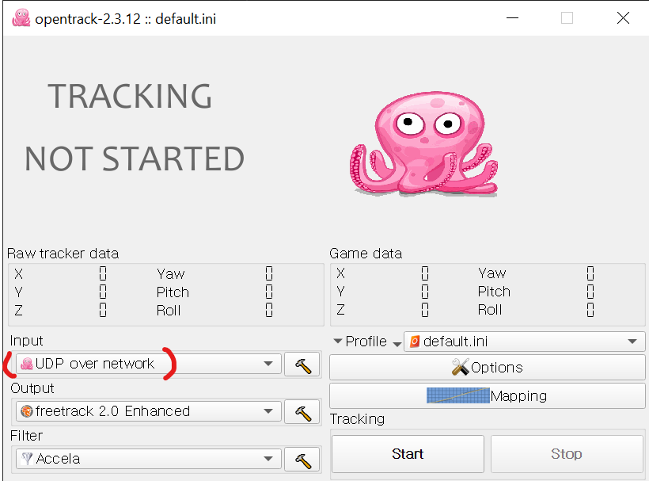
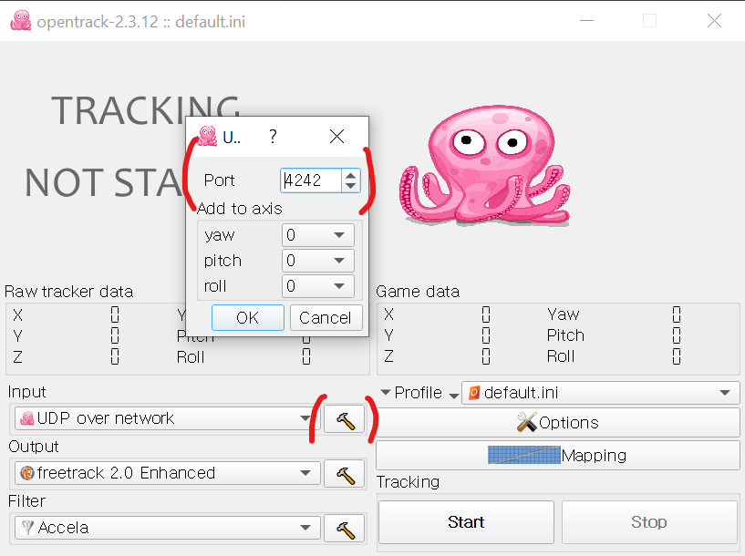
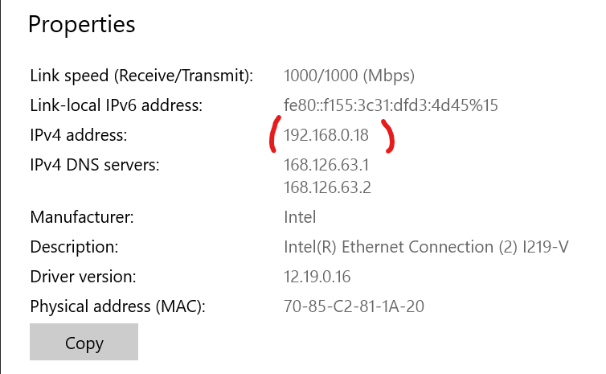
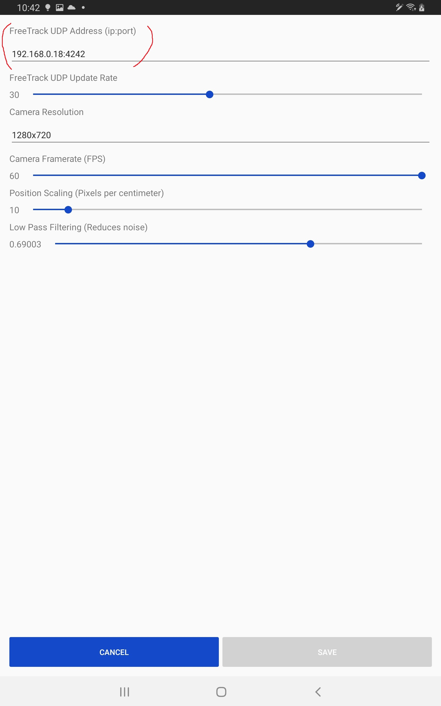
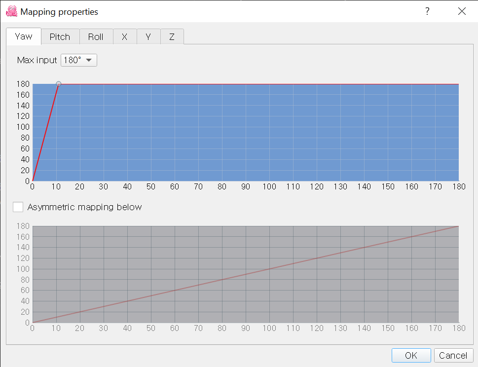

# Head Pose Tracker

## Description
Head Pose Tracker is an Android application which utilizes the device camera to estimate the users head pose. The estimated position and rotation is then sent using UDP protocol to compatible games or tools running on the computer. The application can determine the approximate head pose with 6DoF (Degrees of freedom).

Head Pose Tracker application can be downloaded at: [Google Play](https://play.google.com/store/apps/details?id=org.axelwettervik.headposetracker)

## Using with OpenTrack
"opentrack is an application dedicated to tracking user's head movements and relaying the information to games and flight simulation software."

https://github.com/opentrack/opentrack/releases

"opentrack" is compatible with many simulation games. Head Pose Tracker will send the estimated head position and rotation to opentrack which in turn will control the compatible game.

### OpenTrack initial setup
1. Download and start the opentrack software
2. Set `input` to `UDP over network`

3. Open the `input` settings and note the port (default 4242).

4. Press `Start' to start receiving network data.
5. Open computer `Network` settings and note IP address (Head Pose Tracker will need to know this to send data).

### Head Pose Tracker setup
1. Open Head Pose Tracker application on mobile device.
2. Go to settings page by pressing the cog in top right corner.
3. Input the computer IP address and port in opentrack

4. Save settings and make sure the orientation indicator can be seen in camera preview.

After completing these steps Head Pose Tracker will start sending position and rotation data to `opentrack` the pink octopus should move according to head movements detected by Head Pose Tracker.

### Tweak opentrack mapping/curves
Head Pose Tracker can only detect limited head movement ~20 degrees in any direction. So it's encouraged to tweak the curves used to map input data to in game movement. This can be done in the mapping page of `opentrack`. Yaw, Pitch, Roll, X, Y, and Z can all be tweaked separately.

### Bind OpenTrack center keybinding
It can be conventient to 'center' the pose in opentrack. This allows the user to find a comfortable head position and then keep all movements relative to that. This can be done in the `opentrack` options page. Open the options page and go to `Shortcuts` tab, find the `Center` action and bind it to the desired key.

Now with application and `opentrack` running the desired game can be started. Some games might require additional configuring before working properly with `opentrack`.

